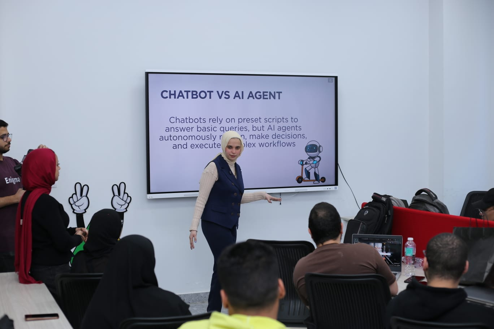

# AI Shopping Agent: Multi-Agent E-commerce Deal Finder

This project is an AI-powered shopping agent that helps users find the best product deals across multiple e-commerce websites in Egypt (such as Amazon.eg, Jumia, and Noon). It uses a crew of specialized agents to generate targeted search queries, collect product pages, scrape product details, and build a professional HTML procurement report using Bootstrap. 

## Features

- Generates specific product search queries optimized for e-commerce product pages, not blogs or generic listings.   
- Searches multiple websites for product links and filters out low-relevance or spammy results based on a score threshold.  
- Scrapes product pages to extract title, price, discount, image URL, and key specifications.  
- Ranks products and provides recommendation notes to support procurement decisions.  
- Creates a structured HTML procurement report (with Bootstrap) including: executive summary, methodology, findings, analysis, recommendations, and conclusion.  
- Simple Gradio interface where the user enters a product name and gets aggregated results. 

## Tech Stack

- Python (Jupyter/Colab notebook)   
- CrewAI for multi-agent orchestration (planner, search agent, search-engine agent, scraper, report generator, procurement report author) 
- Tavily search client for web search tool integration   
- ScrapeGraph / web scraping client for structured product extraction  
- Bootstrap for the final HTML report UI  
- Gradio for a simple web interface to run the agent workflow. 

## How It Works

1. **Search query generation**  
   A Search Query Generator agent creates several specific queries (including brands like Samsung, Apple, Lenovo) tailored to buy a given product (e.g., Tablet) in Egypt. 

2. **Search engine agent**  
   A Search Engine Agent calls a Tavily-based search tool to get product links only, discarding blogs and non-product pages, and keeps only results above a given relevance score. 

3. **Web scraping agent**  
   A Scraper Agent uses a smart scraping tool to extract structured product data (title, URLs, prices, specs) from each product page. 

4. **Procurement report author**  
   A Procurement Report Author Agent and Report Generator Agent take all extracted products and generate a detailed HTML procurement report with Bootstrap styling. 

5. **User interface**  
   A Gradio app wraps the whole pipeline so the user can type a product name and receive summarized, ranked results and reports.

## Use Cases

- Internal procurement teams comparing prices across multiple online stores.  
- Market research for specific product categories (e.g., tablets, electronics).  
- Educational demo of multi-agent AI workflows for search, scraping, and reporting.

## Future Improvements

- Support more countries and e-commerce websites. 
- Add dashboards and charts directly into the HTML report. 
- Integrate more LLM models and smarter ranking logic. 

## Background

This project was originally developed as part of a hands-on AI agents workshop that I delivered as a speaker at an ITI event in Damanhour. During the workshop, I walked participants through building a multi-agent AI shopping assistant that generates search queries, scrapes structured product data from e-commerce websites, and creates a professional HTML procurement report using Bootstrap. The notebook in this repository is the same one used live in the workshop.

  

